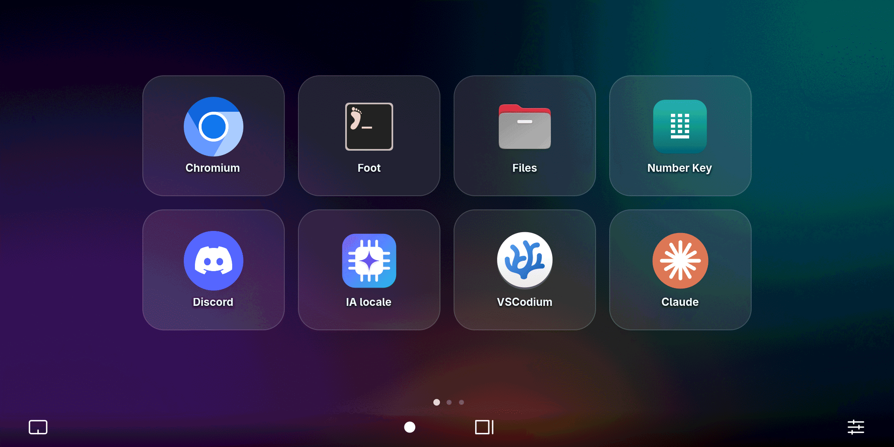
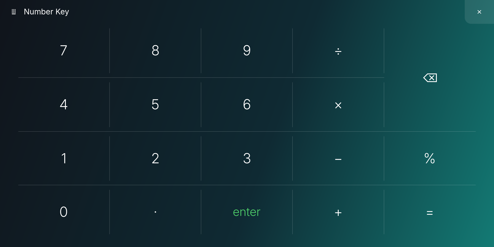
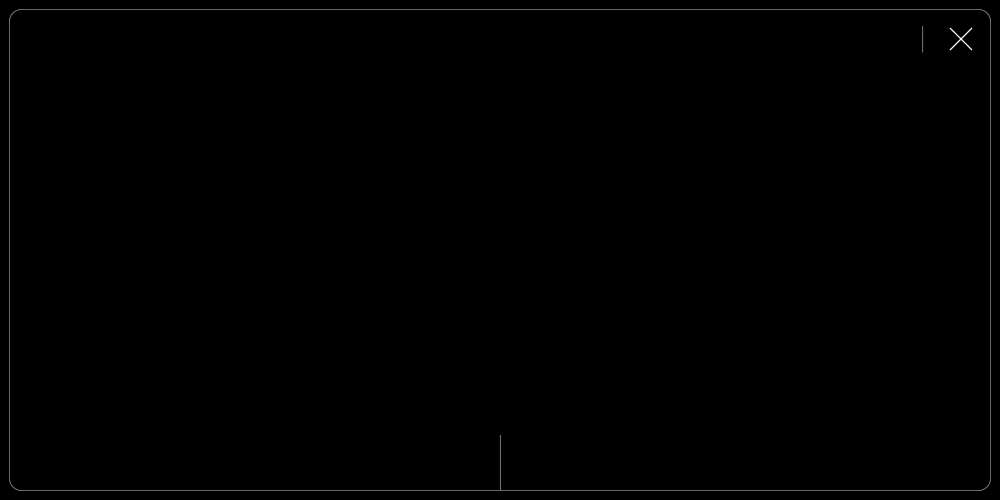

# asus-screenpad-linux

[English version](README.md)

Fait fonctionner le ScreenPad d'un ASUS ZenBook sous Linux, comme second écran
et comme surface tactile.

Testé sur un ZenBook 14X OLED UX5400EA (ScreenPad 2.0, 2160×1080).



## Problème

Sous Linux, le ScreenPad n'apparaît pas. Aucun écran supplémentaire n'est
détecté et tous les connecteurs DisplayPort sont `disconnected`, comme un port
vide.

Il ne manque pas de pilote : le firmware laisse le panneau éteint, et un
panneau éteint ne se distingue pas d'un panneau absent.

Les projets existants (`asus-wmi-screenpad`, `screenpad-tools`,
`asus-screenpad-control`) gèrent seulement la luminosité d'un ScreenPad déjà
allumé, ou passent par le compositeur. Aucun n'allume le panneau.

## Solution

Le firmware possède une méthode ACPI pour ça, que le pilote `asus-wmi` du noyau
n'expose pas :

```
\_SB.ATKD.WMNB → méthode DEVS → device id 0x00050031 ← alimentation du ScreenPad
```

Une fois le panneau alimenté, le connecteur passe à `connected` et l'écran
s'utilise comme n'importe quel autre.

## Installation

```sh
sudo ./install.sh
```

Nécessite `acpi_call-dkms` (Arch) ou `acpi-call-dkms` (Debian/Ubuntu).

## Utilisation

```sh
screenpad-power on               # allume le panneau
screenpad-power off              # l'éteint
screenpad-power status           # 0x100a0 = allumé, 0x10000 = éteint
screenpad-power brightness 128   # luminosité, de 1 à 255 (sans valeur : la lit)

screenpad-touchmode touch        # le pad devient un écran tactile
screenpad-touchmode pointer      # le pad redevient un trackpad
```

`screenpad.service` allume le panneau au démarrage et à chaque sortie de
veille, car le firmware l'éteint à chaque fois.

## Configuration de l'écran

Le panneau se déclare en portrait 1080×2160 et doit être pivoté. Avec
Hyprland :

```lua
hl.monitor({ output = "HDMI-A-2", mode = "1080x2160@60",
             position = "0x900", scale = 2, transform = 3 })
```

Le connecteur est HDMI-A-2, pas un port DisplayPort. Pour vérifier le sien :
`hyprctl monitors` ou `drm_info` une fois le panneau allumé.

## Tactile

Le pad ne peut pas être trackpad et écran tactile en même temps. Windows a la
même limite et bascule entre les deux par un geste à trois doigts.

`screenpad-touchmode` reclasse le périphérique via udev. Le firmware ignore la
méthode standard (le champ `Input Mode` du descripteur HID est accepté puis
ignoré), c'est donc la seule solution.

En mode tactile, le compositeur doit aussi savoir à quel écran correspond la
surface :

```lua
hl.device({ name = "gdx1515:00-27c6:01f4-touchpad", output = "HDMI-A-2" })
```

## Outils Hyprland

Le dossier [`hyprland/`](hyprland/) contient un lanceur inspiré d'ASUS
ScreenXpert : écran d'accueil sur le fond d'écran du bureau, barre de
navigation, Control Center, Number Key, Quick Key, App Navigator et mode
trackpad. Un cycle à trois états reproduit le `Fn+F6` de Windows.

| Number Key | Mode trackpad |
|---|---|
|  |  |

[`docs/FINDINGS.fr.md`](docs/FINDINGS.fr.md) décrit comment la méthode a été trouvée :
décompilation du DSDT pour obtenir les identifiants WMI, et rôle des autres
identifiants non documentés.

## Attention à la luminosité

Ne pas écrire dans `/sys/class/backlight/asus_screenpad` (`brightnessctl`,
curseur de luminosité du bureau…). Jusqu'à Linux 7.1 au moins, `asus-wmi` lit
l'état d'alimentation à l'envers : chaque réglage de luminosité par le sysfs
éteint le panneau, quelle que soit la valeur. Le connecteur et l'écran
disparaissent.

Utiliser plutôt `screenpad-power brightness <1-255>`, qui passe par le
firmware. Le correctif du noyau a été accepté (voir
[`docs/FINDINGS.fr.md`](docs/FINDINGS.fr.md#piège-de-la-luminosité--un-bug-du-pilote-pas-du-firmware)).
Si le pad s'est éteint : `screenpad-power on`.

## Licence

GPL-2.0-or-later, comme les projets dont ce travail s'inspire.

Ce projet n'est ni affilié à ASUS ni approuvé par ASUS. ASUS, ZenBook,
ScreenPad et ScreenXpert sont des marques d'ASUSTeK Computer Inc. Aucun code ni
élément graphique d'ASUS n'est inclus : l'interface est une réimplémentation.

---

*Co-écrit avec Claude Opus 5.5.*
