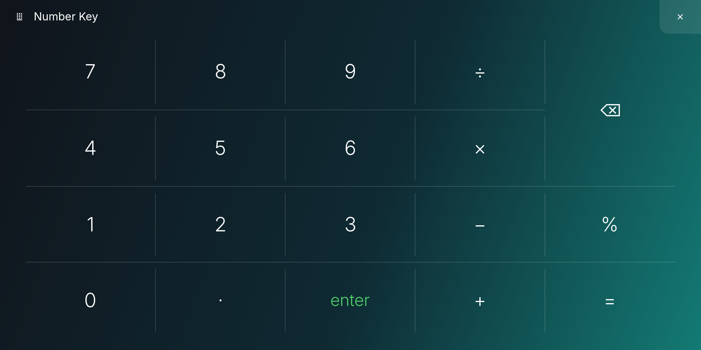
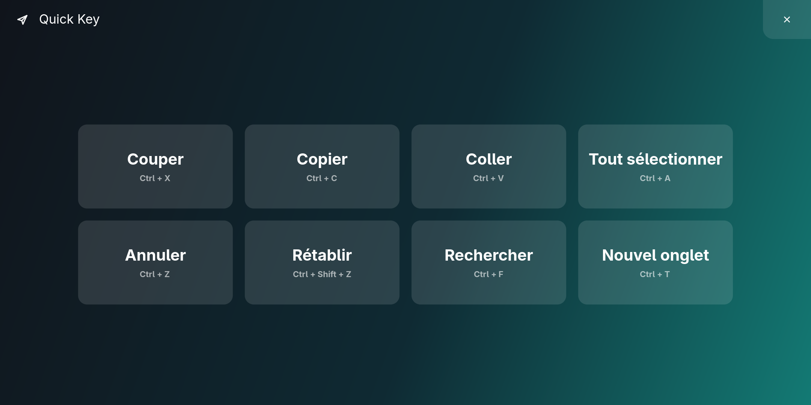
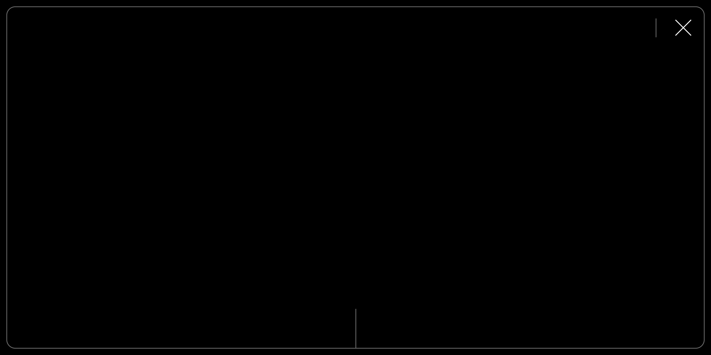

# Outils Hyprland

Optionnels : le cœur du dépôt (`bin/`) suffit à faire apparaître le ScreenPad
comme écran. Ces outils-ci reproduisent l'expérience ScreenXpert de Windows.

| Fichier | Rôle |
|---|---|
| `screenpad-dock.py` | le ScreenXpert Linux : écran d'accueil, barre de navigation, Control Center, Number Key, Quick Key, App Navigator, mode trackpad |
| `screenpad-cycle` | cycle à trois états, équivalent du `Fn+F6` : trackpad seul → écran tactile → tout éteint |
| `screenpad-screensaver.py` | éteint le panneau pendant l'économiseur d'écran et le rallume au réveil |

## Le lanceur, un ScreenXpert pour Linux

Il reprend l'interface ASUS du ScreenPad 2.0 :

- **Barre de navigation**, dans l'ordre d'ASUS : TouchPad à gauche (le pad
  redevient un trackpad), Accueil et App Navigator au centre, Control Center
  à droite. Un glissement vers le haut ouvre aussi le Control Center.
- **Control Center** : luminosité, App Navigator, Number Key, Quick Key,
  TouchPad, verrouillage du pad (un appui long sur le cadenas le libère),
  extinction.
- **Number Key** : le pavé numérique d'ASUS, qui tape dans la fenêtre active
  du grand écran.
- **Quick Key** : huit raccourcis en un toucher (copier, coller, annuler…),
  modifiables dans la configuration.
- **App Navigator** : les fenêtres ouvertes. Un toucher leur donne le focus,
  la croix les ferme.
- **Mode trackpad** : le pavé noir d'ASUS, avec son cadre fin, le trait qui
  sépare les deux zones de clic et une croix pour revenir à l'écran. On y
  entre aussi par un geste à trois doigts.

| Number Key | Quick Key | Mode trackpad |
|---|---|---|
|  |  |  |

Les applications se règlent dans `~/.config/omarchy/screenpad-dock.json`.
Les utilitaires s'y placent comme des applications :

```json
{
  "apps": ["chromium.desktop", "screenxpert:number-key",
           "screenxpert:quick-key", "foot.desktop"],
  "quick_keys": [{"label": "Copier", "keys": "ctrl+c"},
                 {"label": "Capture", "keys": "super+shift+s"}]
}
```

La luminosité ne descend jamais sous 200/255, le seuil sous lequel le
firmware coupe le panneau. Au-delà, un voile noir prend le relais.

Dépendances : `gtk4-layer-shell`, `libadwaita`, `python-gobject`, `wtype`
(pour Number Key et Quick Key), `brightnessctl`, et `uwsm-app` s'il est
présent (les applications lancées reçoivent alors leur propre unité systemd
et survivent à un redémarrage du lanceur).

Le lanceur exige `gtk4-layer-shell`, chargé via `LD_PRELOAD` — la bibliothèque
doit précéder libwayland, ce qu'un import Python ne permet pas.

Ces scripts portent encore des chemins et des noms propres à Omarchy ; ils sont
fournis comme point de départ, pas comme paquet fini.
