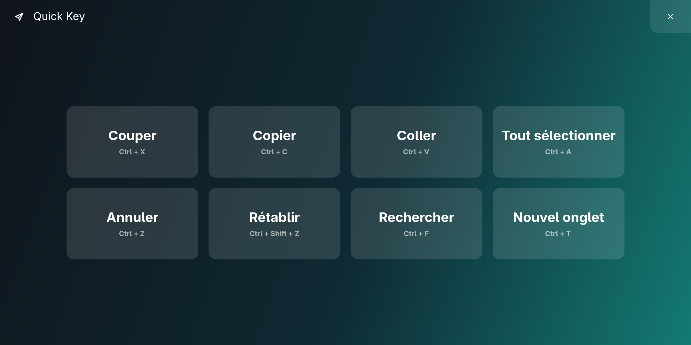

# Hyprland tools

[Version française](README.fr.md)

Optional: the core of the repository (`bin/`) is enough to make the ScreenPad
show up as a display. These tools recreate the ScreenXpert experience from
Windows.

| File | Role |
|---|---|
| `screenpad-dock.py` | launcher inspired by ScreenXpert: home screen, navigation bar, Control Center, Number Key, Quick Key, App Navigator, touchpad mode |
| `screenpad-cycle` | three-state cycle, equivalent to `Fn+F6`: touchpad only → touchscreen → everything off |
| `screenpad-screensaver.py` | turns the panel off during the screensaver and back on at wake-up |

## The launcher

Its interface is inspired by ScreenXpert, the ASUS software for the ScreenPad
2.0:

- **Home screen**: applications, eight per page, over the desktop wallpaper.
- **Navigation bar**, in the ASUS order: TouchPad on the left (the pad becomes
  a touchpad again), Home and App Navigator in the middle, Control Center on
  the right. Swiping up also opens the Control Center.
- **Control Center**: brightness, App Navigator, Number Key, Quick Key,
  TouchPad, pad lock (a long press on the padlock releases it), power off.
- **Number Key**: a numeric keypad that types into the active window on the
  main display.
- **Quick Key**: eight one-tap shortcuts (copy, paste, undo…), configurable.
- **App Navigator**: open windows. A tap focuses them, the cross closes them.
- **Touchpad mode**: a black pad with a thin frame, a line separating the two
  click areas and a cross to go back to the screen. A three-finger gesture
  also enters it.

| Number Key | Quick Key | Touchpad mode |
|---|---|---|
|  |  |  |

Applications are set in `~/.config/omarchy/screenpad-dock.json`. Utilities are
listed like applications:

```json
{
  "apps": ["chromium.desktop", "screenxpert:number-key",
           "screenxpert:quick-key", "foot.desktop"],
  "quick_keys": [{"label": "Copy", "keys": "ctrl+c"},
                 {"label": "Screenshot", "keys": "super+shift+s"}]
}
```

The brightness slider sets the real backlight, but through the firmware
(`screenpad-power brightness`, via `sudo -n`) rather than sysfs: the
`asus-wmi` driver in Linux 7.1 turns the panel off on every sysfs write. A
passwordless sudoers rule for `screenpad-power brightness *` is therefore
required.

Dependencies: `gtk4-layer-shell`, `libadwaita`, `python-gobject`, `wtype` (for
Number Key and Quick Key), and `uwsm-app` if present (launched applications
then get their own systemd unit and survive a launcher restart).

The launcher needs `gtk4-layer-shell` loaded through `LD_PRELOAD`: the library
has to come before libwayland, which a Python import cannot guarantee.

These scripts still contain Omarchy-specific paths and names. They are provided
as a starting point, not as a finished package.
